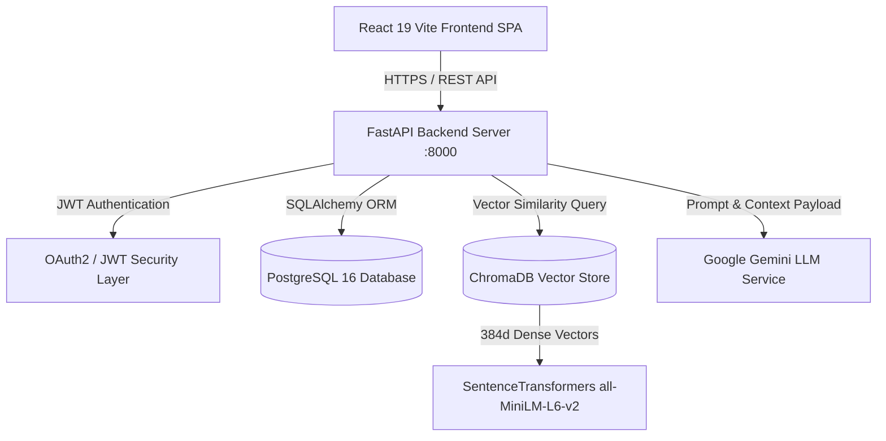
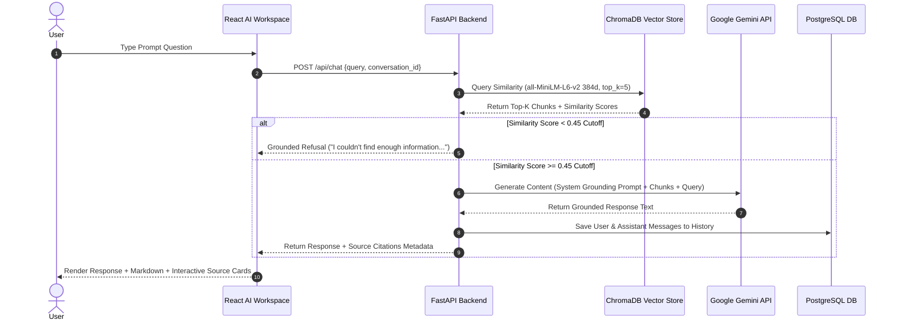

# Vaultonaut Technical Architecture Specification

Vaultonaut is an AI-powered Personal Knowledge Operating System built using a grounded Retrieval-Augmented Generation (RAG) architecture, FastAPI backend, PostgreSQL database, ChromaDB vector store, Google Gemini LLM, and React 19 SPA frontend.

---

## 1. High-Level System Architecture



---

## 2. Grounded RAG Pipeline Sequence



---

## 3. Database Schema Overview

```
users (id, google_id, email, full_name, is_active, created_at)
  └── knowledge (id, user_id, title, content, category, created_at)
  └── documents (id, user_id, filename, file_path, mime_type, file_size, processed_at)
        └── document_chunks (id, document_id, chunk_index, chunk_text, token_count)
              └── embeddings (id, chunk_id, vector_id, embedding_model, dimensions)
  └── conversations (id, user_id, title, created_at, updated_at)
        └── conversation_messages (id, conversation_id, role, content, retrieval_metadata, created_at)
```
