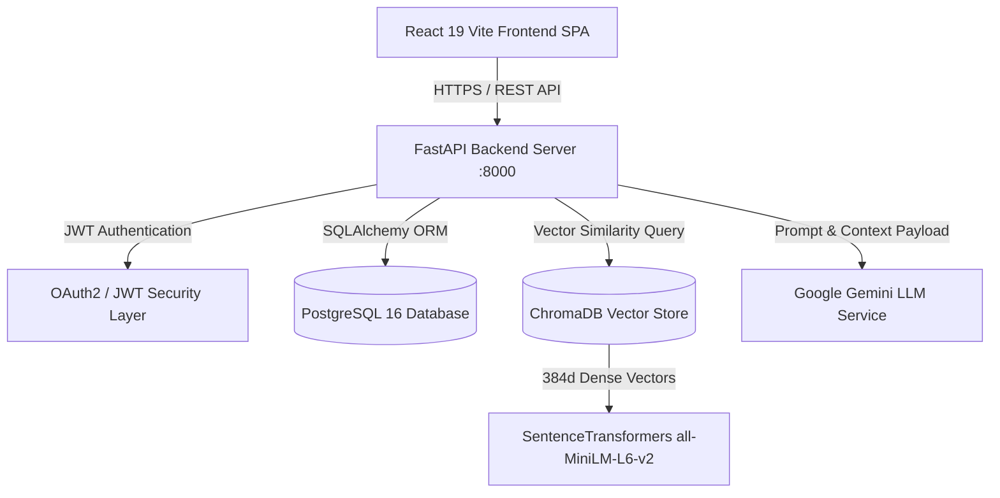

# Vaultonaut 🚀 — AI-Powered Personal Knowledge Operating System


**Vaultonaut** is a production-grade, AI-powered Personal Knowledge Operating System designed to rival products like **NotebookLM**, **Perplexity AI**, **Notion AI**, and **ChatGPT Projects**. 

It transforms personal notes, PDFs, DOCX files, and plain text documents into an interactive, grounded AI knowledge workspace with transparent source attribution, zero hallucinations, syntax-highlighted code execution blocks, and deep vector citation inspection.

---

## 🌟 Key Features

- 🧠 **Grounded RAG Pipeline**: Combines local `sentence-transformers/all-MiniLM-L6-v2` 384d vector embeddings, ChromaDB vector store, and Google Gemini LLM for anti-hallucination grounded Q&A.
- 🎨 **3-Column AI Workspace**: Modern conversational interface with thread management sidebar, scrollable chat trajectory, and responsive Source Explorer panel.
- 📜 **Rich Response Presentation**: Markdown renderer supporting headings (H1-H6), bold, italic, lists, blockquotes, responsive tables, and syntax-highlighted code blocks with **Copy Code** buttons.
- 🔍 **Interactive Source Citation Explorer**: Inspect exact vector text chunks, visual similarity match progress bars, confidence badges (**High** `>=80%`, **Medium** `>=75%`, **Low` `<75%`), in-chunk text searching, and quick copy/vault actions.
- ⚙️ **AI Settings & Diagnostics Hub (`/settings/ai`)**: Real-time telemetry dashboard, Developer Mode inspector, service health diagnostics (`/health/detailed`), and keyboard shortcut reference guide.
- 🛡️ **Production Security & Hardening**: Rate limiting middleware (200 req/min), structured JSON logging (`X-Correlation-ID`), prompt injection defenses, empty query validation, and composite database indexing (`idx_conversations_user_updated` and `idx_messages_conv_created`).
- ⚡ **Advanced Conversational UX**: Stop Generation button (`AbortController`), prompt draft saving per thread, stage-based thinking indicators, Jump to Bottom floating scroll button, and production toast notifications.

---

## 🏗️ System Architecture



---

## 🛠️ Technology Stack

| Layer | Technologies |
|---|---|
| **Frontend** | React 19, Vite, Vanilla CSS (Glassmorphism design system), Lucide Icons, Framer Motion |
| **Backend API** | Python 3.12+, FastAPI, Uvicorn, Pydantic v2, PyPDF/PyMuPDF, docx |
| **Database & ORM** | PostgreSQL 16, SQLAlchemy 2.0 ORM, Alembic Migrations |
| **Vector DB & Embeddings** | ChromaDB Persistent Store, `sentence-transformers/all-MiniLM-L6-v2` (384d) |
| **LLM Provider** | Google Gemini API (`gemini-1.5-flash` with grounded prompt injection defense) |
| **DevOps & Testing** | Docker, Docker Compose, Pytest (42 tests), Oxlint, NGINX |

---

## 🚀 Quick Start Guide

### Prerequisites
- Python 3.12+
- Node.js 20+
- PostgreSQL 16 (or SQLite for local dev)
- Google Gemini API Key (`GEMINI_API_KEY`)

---

### Option A: Local Development Setup

1. **Clone Repository**:
   ```bash
   git clone https://github.com/jadedarun/vaultonaut.git
   cd vaultonaut
   ```

2. **Configure Environment Variables**:
   Create `backend/.env`:
   ```env
   PROJECT_NAME="Vaultonaut AI Engine"
   ENVIRONMENT="development"
   DATABASE_URL="sqlite:///./vaultonaut.db"
   GEMINI_API_KEY="your_google_gemini_api_key_here"
   GEMINI_MODEL="gemini-1.5-flash"
   RAG_TOP_K=5
   RAG_SIMILARITY_THRESHOLD=0.75
   JWT_SECRET_KEY="your_random_secret_key"
   ```

3. **Backend Setup & Migrations**:
   ```bash
   cd backend
   python -m venv venv
   source venv/bin/activate  # On Windows: venv\Scripts\activate
   pip install -r requirements.txt
   alembic upgrade head
   uvicorn main:app --reload --port 8000
   ```

4. **Frontend Setup**:
   ```bash
   # In root directory
   npm install
   npm run dev
   ```
   Open `http://localhost:5173` in your browser.

---

### Option B: Docker Compose Setup

Run the full stack (FastAPI, PostgreSQL, ChromaDB, NGINX Frontend) using Docker Compose:

```bash
docker-compose up --build
```
- **Frontend SPA**: `http://localhost`
- **Backend API**: `http://localhost:8000`
- **Interactive API Docs**: `http://localhost:8000/docs`

---

## 🧪 Running Automated Test Suite

Execute the complete backend pytest suite (42 test cases covering unit mocks, security, health, RAG pipeline, and authentication):

```bash
cd backend
pytest
```

---

## 📑 API Endpoint Reference

| Method | Endpoint | Description | Auth Required |
|---|---|---|---|
| `GET` | `/health` | Basic system health check | No |
| `GET` | `/health/detailed` | Detailed diagnostics (DB, ChromaDB, Gemini, Disk, Memory) | No |
| `POST` | `/api/chat` | Send Q&A prompt to Grounded RAG Assistant | Yes (JWT) |
| `POST` | `/api/chat/new` | Create new conversation thread session | Yes (JWT) |
| `GET` | `/api/chat/history` | List user conversation threads | Yes (JWT) |
| `GET` | `/api/chat/{id}` | Get full conversation message trajectory | Yes (JWT) |
| `PATCH` | `/api/chat/{id}` | Rename conversation thread | Yes (JWT) |
| `DELETE` | `/api/chat/{id}` | Delete conversation thread | Yes (JWT) |
| `GET` | `/api/chat/sources/{msg_id}` | Get vector chunk sources for message | Yes (JWT) |
| `POST` | `/api/search/similarity` | Execute raw vector similarity search | Yes (JWT) |

---

## 📂 Project Directory Structure

```
vaultonaut/
 ├── backend/
 │    ├── alembic/                 (Alembic database migration versions 0001 to 0005)
 │    ├── app/
 │    │    ├── api/                (FastAPI routers: chat, search, documents, health, auth)
 │    │    ├── config/             (Pydantic settings configuration)
 │    │    ├── core/               (Logging & JWT security functions)
 │    │    ├── database/           (SQLAlchemy session & engine setup)
 │    │    ├── middleware/         (Rate limiting & structured logging middleware)
 │    │    ├── models/             (User, Knowledge, Document, Chunk, Embedding, Conversation models)
 │    │    ├── schemas/            (Pydantic request/response schemas)
 │    │    └── services/           (RAG engine, Chunking, Embedding, VectorStore, Gemini Provider)
 │    ├── tests/                   (42 pytest cases for RAG pipeline, security, health, unit mocks)
 │    ├── Dockerfile               (Backend production image)
 │    ├── main.py                  (FastAPI application entry point)
 │    └── requirements.txt         (Python dependencies)
 ├── src/
 │    ├── components/
 │    │    └── ai/                 (AI Workspace, ChatWindow, ConversationSidebar, SourcePanel, Settings)
 │    ├── context/                 (AIWorkspaceContext, AuthContext, DocumentContext)
 │    ├── hooks/                   (useChat, useConversation, useMessages, useToast, useDrafts, etc.)
 │    ├── services/                (chatApi.js client layer, analytics.js telemetry)
 │    └── App.jsx                  (Root React application component)
 ├── docker-compose.yml            (Docker orchestration)
 ├── Dockerfile                    (Frontend production NGINX image)
 ├── ARCHITECTURE.md               (Technical system architecture specification)
 ├── CHANGELOG.md                  (Semantic versioning changelog v0.1.0)
 ├── CONTRIBUTING.md               (Developer contribution guidelines)
 └── LICENSE                       (MIT License)
```

---

## 📌 Known Limitations & Future Roadmap

### Current Limitations
- Single AI Provider active at a time (Google Gemini).
- Local storage for vector embeddings (ChromaDB persistent directory).
- Single-user document boundary (no collaborative shared team vaults).

### Future Roadmap
- 🔮 **Multi-Provider Switching**: Support for OpenAI GPT-4o, Anthropic Claude 3.5 Sonnet, and local Ollama/Llama 3.
- 📄 **OCR & Multimodal Parsing**: Image, scanned document, and audio transcript chunking.
- 🌐 **Web Search Hybrid RAG**: Combine local vector retrieval with real-time web search fallback.
- 🤝 **Collaborative Workspaces**: Shared team vaults with fine-grained access control.

---

## 📄 License & Acknowledgements

This project is licensed under the [MIT License](file:///d:/vaultonaut/LICENSE).

Designed & Engineered with ❤️ by the **Vaultonaut AI Engineering Team**.
