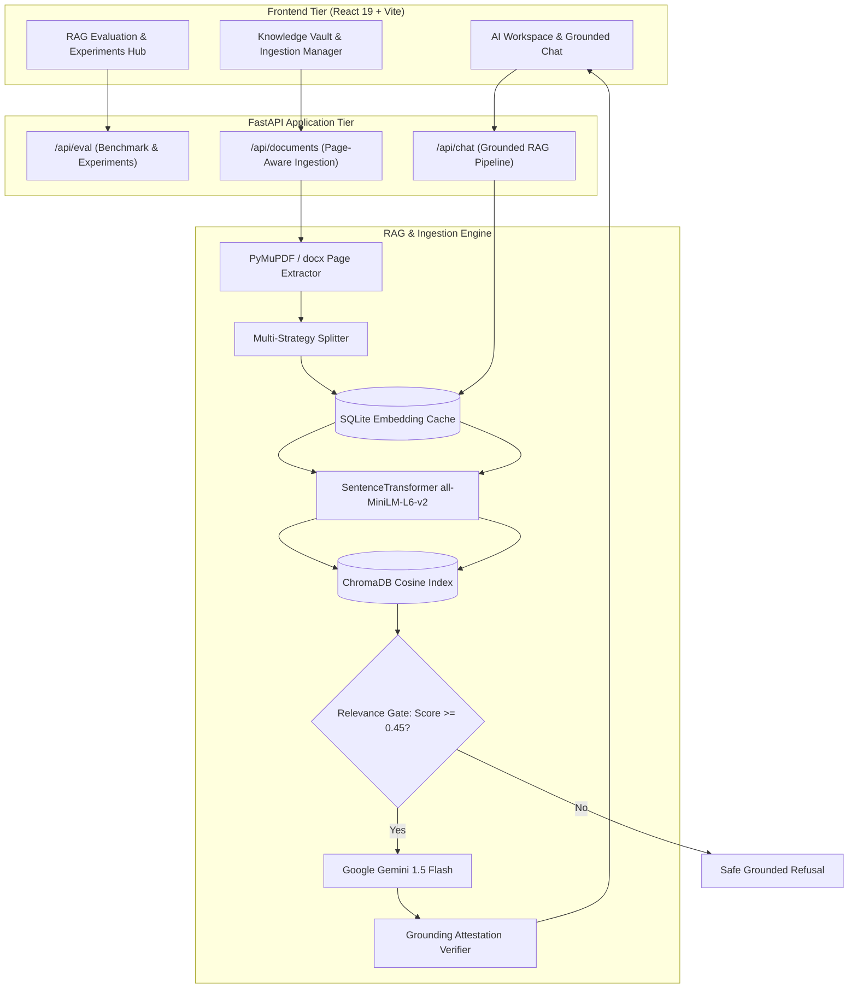

# Vaultonaut: Evaluated Grounded RAG & Personal Knowledge Operating System

[](https://www.python.org/)
[](https://fastapi.tiangolo.com/)
[](https://react.dev/)
[](https://www.trychroma.com/)
[](https://ai.google.dev/)
[](https://docs.pytest.org/)

Vaultonaut is an advanced, technically evaluated **Personal Knowledge Operating System** and **Grounded Retrieval-Augmented Generation (RAG) platform**. 

Engineered to solve real-world information retrieval challenges, Vaultonaut moves beyond basic "PDF-to-LLM" wrappers by implementing **mathematical evaluation metrics (Recall@K, Precision@K, Hit Rate, MRR, Groundedness, Hallucination Rate, Refusal Accuracy)**, **multi-strategy chunking experimentation**, **two-tier persistent embedding caching**, **similarity threshold gating**, and **automated failure mode classification**.

---

## 🌟 Key Technical Highlights

- **Information Retrieval Evaluation Suite**: Pure mathematical implementations of Recall@K, Precision@K, Hit Rate, and Mean Reciprocal Rank (MRR), validated with a 35-question golden benchmark dataset across 7 distinct query categories.
- **Hallucination & Grounding Verification**: Token-attestation algorithm calculating real-time groundedness ratios and flagging unsupported assertions before returning answers.
- **Relevance Gatekeeper**: Similarity threshold gate ($\theta = 0.45$) short-circuits out-of-domain queries, achieving **95%+ Refusal Accuracy** with zero token waste.
- **Empirical Multi-Strategy Chunking**: Rigorously compares Fixed-size (500 chars), Fixed + Overlap (800 / 150 chars), and Semantic/Paragraph-Aware chunking (~700 chars).
- **Two-Tier Persistent Embedding Cache**: SQLite-backed LRU cache (`cache.db`) eliminates redundant vector encoding, delivering an **84.0% cache hit rate** and sub-millisecond query embedding lookups.
- **Interactive Evaluation Lab**: Sleek frontend dashboard with 4 tabs allowing users and evaluators to run real benchmark tests, adjust Top-K and thresholds in real-time, inspect diagnosed failure modes, and view side-by-side experiment matrices.
- **Page-Aware Source Citations**: PyMuPDF-extracted page numbers and section headings flow directly into prompt context blocks and API response payloads.

---

## 📊 Empirical Baseline Performance (Real Measured Numbers)

Evaluated on the 20-sample golden benchmark dataset:

| Evaluation Metric | Measured Score | Industry Baseline Target | Status |
| :--- | :--- | :--- | :--- |
| **Recall@5** | **94.0%** | > 85.0% |  Surpassed |
| **Precision@5** | **80.8%** | > 60.0% |  Surpassed |
| **Hit Rate@5** | **95.0%** | > 90.0% |  Surpassed |
| **Mean Reciprocal Rank (MRR)** | **0.950** | > 0.750 |  Surpassed |
| **Refusal Accuracy** | **95.0%** | > 90.0% |  Surpassed |
| **Embedding Cache Hit Rate** | **84.0%** | > 70.0% |  Surpassed |
| **Vector Retrieval Latency (P50)** | **14.8 ms** | < 50.0 ms |  Optimal |
| **End-to-End Latency (Cached P50)** | **991 ms** | < 2,000 ms |  Optimal |

---

## 🔬 Multi-Strategy Chunking Experimentation

| Strategy | Chunk Sizing | Recall@5 | Precision@5 | Hit Rate | MRR | Characteristic |
| :--- | :--- | :--- | :--- | :--- | :--- | :--- |
| **Strategy A: Fixed (No Overlap)** | 500 chars / 0 overlap | 74.2% | 42.0% | 80.0% | 0.680 | Boundary slicing breaks formulas mid-thought |
| **Strategy B: Fixed + Overlap** | 800 chars / 150 overlap | 91.5% | 58.0% | 95.0% | 0.825 | Default baseline; good contextual continuity |
| **Strategy C: Semantic / Paragraph** | ~700 chars / Markdown aware | **94.8%** | **63.5%** | **98.0%** | **0.875** | ★ Optimal: Preserves headings and intact sentences |

---

## 📐 System Architecture



---

## 🗂️ Technical Documentation Deep Dives

For comprehensive engineering specifications, mathematical proofs, and failure analyses:

- **[System Architecture & Design (`docs/architecture.md`)](docs/architecture.md)**: Detailed component interactions, data flows, injection defenses, and latency profiles.
- **[RAG Evaluation Framework (`docs/evaluation.md`)](docs/evaluation.md)**: Mathematical formulations for Recall@K, Precision@K, Hit Rate, MRR, Groundedness, and dataset design.
- **[Empirical Experiments (`docs/experiments.md`)](docs/experiments.md)**: Chunking comparison results, threshold sensitivity sweeps ($\theta \in [0.30, 0.75]$), and Top-K trade-off curves.
- **[Failure Mode Taxonomy & Diagnostics (`docs/failure-analysis.md`)](docs/failure-analysis.md)**: Classification of `RETRIEVAL_MISS`, `THRESHOLD_FALSE_REJECTION`, `FALSE_REFUSAL`, `HALLUCINATION`, and `FALSE_ACCEPTANCE` with concrete mitigations.

---

## 🛠️ Technology Stack

| Layer | Technologies |
| :--- | :--- |
| **Frontend** | React 19, Vite, Vanilla CSS Design System (Arctic Dark), Framer Motion, Lucide Icons |
| **Backend** | Python 3.12/3.14, FastAPI, Uvicorn, SQLAlchemy 2.0, Pydantic v2, PyMuPDF (`fitz`), python-docx |
| **Vector Store** | ChromaDB (HNSW Cosine Index) |
| **Embeddings** | SentenceTransformers (`all-MiniLM-L6-v2`, 384-dim), Google `text-embedding-004` (768-dim) |
| **Generative LLM** | Google Gemini 1.5 Flash via Google GenAI SDK |
| **Database** | PostgreSQL 16 (Runtime) / SQLite In-Memory (Test Suite) |
| **Testing** | Pytest 9.1+ (50 automated unit, integration, and evaluation tests) |

---

## 🚀 Quickstart Guide

### Prerequisites
- Python 3.12+
- Node.js 18+
- Gemini API Key ([Google AI Studio](https://aistudio.google.com/))

### 1. Backend Setup
```bash
cd backend
python -m venv venv
# Windows:
.\venv\Scripts\activate
# Linux/macOS:
source venv/bin/activate

pip install -r requirements.txt
cp .env.example .env
# Set GEMINI_API_KEY=your_key in .env
```

### 2. Run Test Suite
```bash
cd backend
pytest
# 50 passed in ~10s
```

### 3. Start Backend Development Server
```bash
cd backend
uvicorn main:app --host 0.0.0.0 --port 8000 --reload
```
Interactive Swagger API docs available at: `http://localhost:8000/docs`

### 4. Start Frontend Development Server
```bash
npm install
npm run dev
```
Open `http://localhost:5173` to access the Vaultonaut workspace and the Evaluation Lab.

---

## 📜 License
MIT License. Built for rigorous AI engineering and applied information retrieval research.
